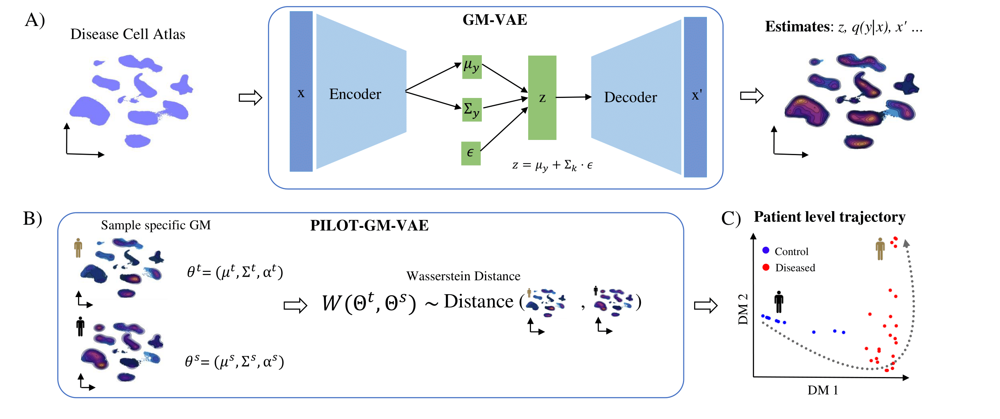

[](https://github.com/CostaLab/PILOT?tab=MIT-1-ov-file#MIT-1-ov-file)

### PILOT-GM-VAE

Patient-Level Analysis of Single Cell Disease Atlas with Optimal Transport of Gaussian Mixtures Variational Autoencoders.
We introduce here PatIent-Level Analysis with Optimal Transport based on Gausian Mixture  Variational AutoEncoders. PILOT-GM-VAE explores the power of GM-VAE to estimate models describing complex single cell distributions with efficient optimal transport algorithms for estimating the distance between GMs.




```terminal
git clone https://github.com/CostaLab/PILOT-GM-VAE.git

cd PILOT-GM-VAE

conda create --name PILOT-GM-VAE python=3.11.5 r-base

conda activate PILOT-GM-VAE

pip install .
```

### Navigate to Tutorial.

Then please use the provided Tutorial.


### Data sets

You can access the used data sets by PILOT-GM-VAE in Part 1 [](https://zenodo.org/records/8370081), Part 2 [](https://zenodo.org/records/7957118) and Part 3 
[](https://zenodo.org/records/14615923)


